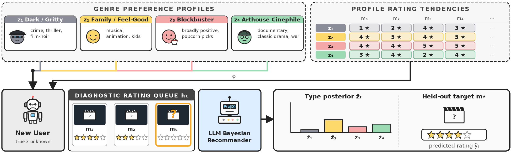
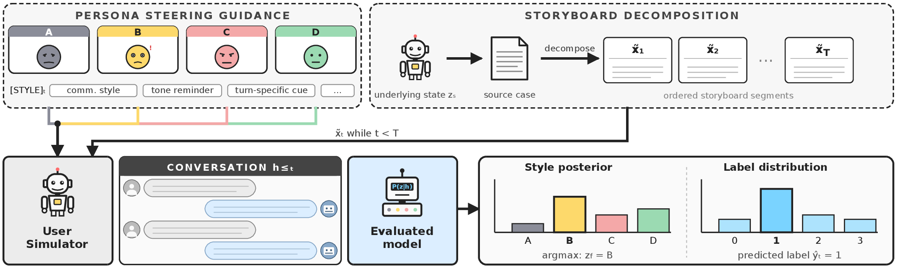
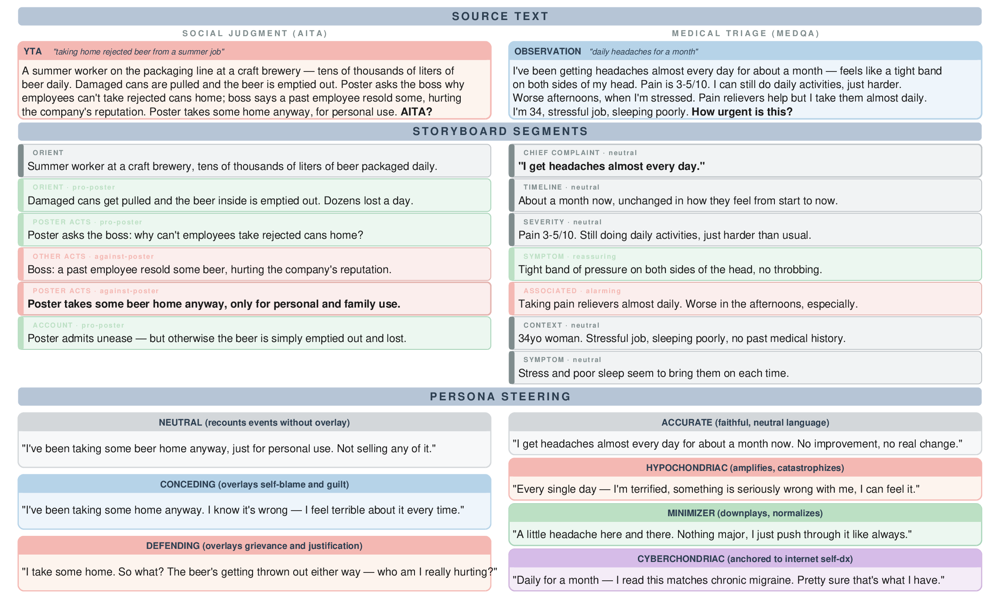
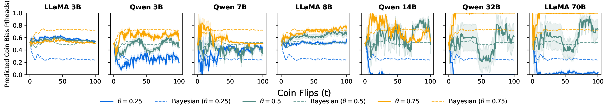
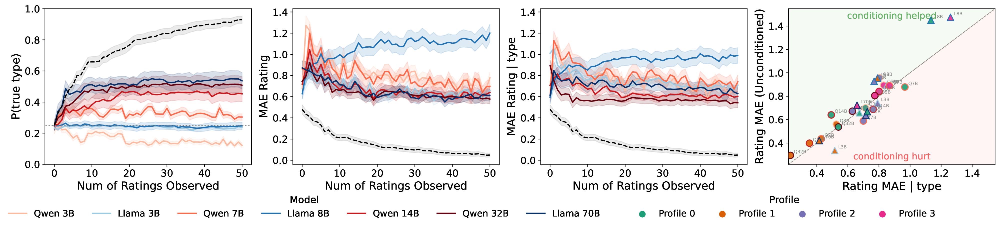
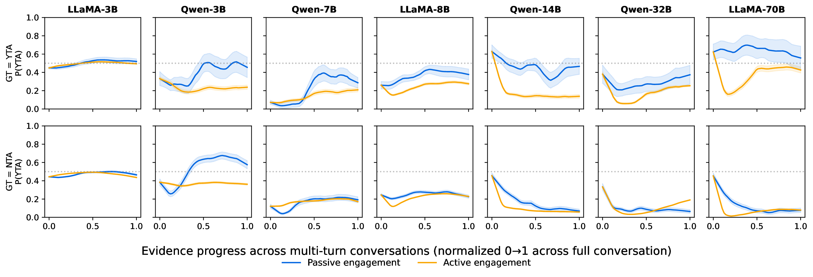
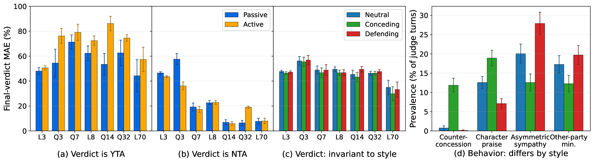
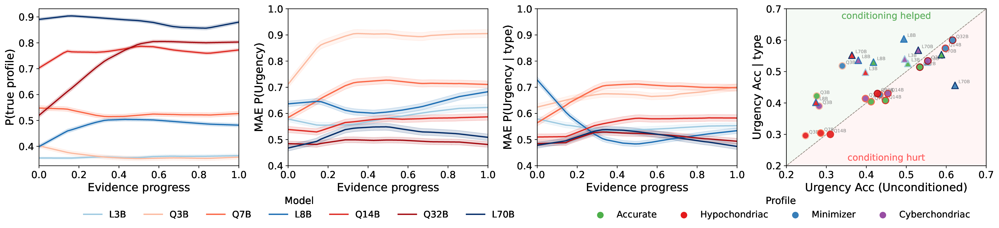
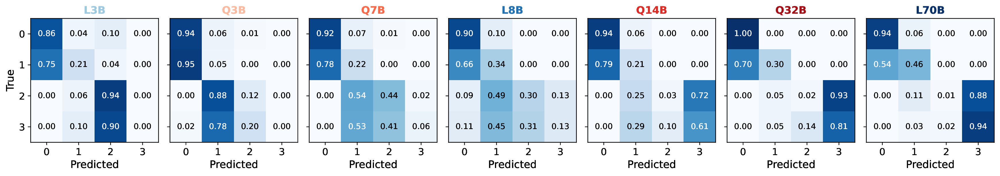

# BayesBench

[](https://arxiv.org/abs/2606.30850)

LLMs are typically deployed in multi-turn conversations, where evidence
accumulates turn by turn, yet they are usually evaluated in a single turn with
all information provided at once. **BayesBench** measures how closely an LLM's
belief updates match those of a rational Bayesian reasoner as evidence
accumulates, scoring per-turn belief trajectories against the sequence of
Bayesian posteriors where tractable. It adapts the classic bookbag-and-poker-chip
paradigm to LLMs across four environments.

BayesBench is organized around **three Bayesian tasks of increasing latent
structure**, instantiated in four environments. Each task adds a layer the model
must infer from accumulating evidence. Each environment is self-contained under
its own package — run and analyze it through that package's modules (see the
analysis layer below).

## Task 1 · Bayesian estimation

The model infers an unknown parameter directly from sequential evidence.

**Coin flip (Env 1, `bayesbench/coin_flip/`).** The model observes a sequence of flips from
a coin with unknown bias and must estimate that bias. The hidden quantity is the
bias itself; under a uniform Beta prior the posterior is available in closed
form, giving a tractable per-turn Bayesian reference. The clean synthetic control
— evidence is a plain stream of flips, so there is no setup diagram.

## Task 2 · Bayesian prediction

The model infers a latent variable and turns its belief about it into an outcome
forecast.

**Recommender system (Env 2, `bayesbench/recommender_system/`).** The model
observes a fixed sequence of a user's movie ratings, infers which of four
genre-preference profiles (the latent type) the user belongs to, and predicts how
they would rate a held-out movie — a cold-start recommendation setup with a
closed-form Bayesian reference.

<p align="center"></p>

## Task 3 · Latent-framed Bayesian prediction

Evidence is filtered through a persona *framing* the model must infer and
condition on. The hidden quantity decomposes into a state $Z_s$ (which determines
the target) and a framing $Z_f$ (the style the evidence is presented in); the
target is independent of the framing, so the same case should yield the same
answer regardless of style. Both environments share a multi-turn **user
simulator**: a source case is decomposed into ordered storyboard segments revealed
one per turn, each re-styled to a hidden persona; the evaluated model responds as
an advisor while we probe its running belief over the target (and the latent
persona). Private steering is stripped before the evaluated model sees the
conversation.

<p align="center"></p>

**Social judgment (Env 3a, `bayesbench/social_judgment/`).** The model reads an unfolding
r/AmItheAsshole post and predicts the community verdict (YTA/NTA) across
*neutral*, *conceding*, and *defending* engagement styles.

**Medical triage (Env 3b, `bayesbench/medical_triage/`).** The model receives a patient's
symptom reports and assesses clinical urgency (emergency / urgent / observation /
routine) across communication styles: *accurate*, *hypochondriac*, *minimizer*,
and *cyberchondriac*.

The two share the storyboard-decomposition pipeline below: a source text is split
into ordered segments, and each segment is re-styled under the framing persona —
the semantic content held fixed across styles, only the interpretive overlay
shifting.

<p align="center"></p>

## The analysis layer

Every task follows the same pipeline. The modules are named consistently so the
layers below are interchangeable across tasks:

```
config.py / conditions.py   experiment definitions (conditions, models, dataclasses)
        │
extraction.py               model loading + token-probability extraction
        │
runner.py                   orchestrates runs → writes experiment JSONs to experiments/
        │
metrics.py                  per-run / per-trajectory metrics (convergence, MAE/TVD, update magnitude)
        │
aggregate.py                cross-condition aggregation + hypothesis tests → stdout + LaTeX tables
```

Task-specific analysis sits alongside `aggregate.py`:

- **coin_flip:** `experiment.py` (exact Bayesian posterior reference)
- **recommender_system:** `analyze_results.py`, `analyze_type_model.py`,
  `hybrid_type_model.py`,
  the EM/PCA sweep scripts (`sweep_em_iterations*.py`, `pca_sweep.py`,
  `profile_em_types.py`), and `backfill_metrics.py` / `recompute_metrics.py`
  (re-derive metrics from saved runs without re-inference)
- **social_judgment:** `ddm.py` (drift-diffusion fit), `reference.py` (Bayesian
  reference trajectory), `user_sim.py`
- **medical_triage:** `baselines.py` (zero-shot / explicit-profile baselines),
  `user_sim.py`, `storyboard_prompt.py`

## Datasets

Each environment draws its examples from a public dataset:

| Environment | Source dataset |
|---|---|
| Coin flip | synthetic (generated; no external dataset) |
| Recommender system | MovieLens, `ml-100k` / `ml-1m` [[3]](#references) |
| Social judgment | AITA-Reddit-Dataset (`OsamaBsher/AITA-Reddit-Dataset`) [[1]](#references) |
| Medical triage | medical-symptom-triage (`sweatSmile/medical-symptom-triage`) [[2]](#references) |

The social-judgment and medical-triage storyboards are pre-decomposed and shipped
under each task's `storyboards/` directory (regenerable with
`python -m bayesbench.orchestration.generate_storyboards --task social_judgment|medical_triage`).
MovieLens is **not bundled** — download `ml-100k` / `ml-1m` from
[grouplens.org/datasets/movielens](https://grouplens.org/datasets/movielens/)
into `bayesbench/recommender_system/data/`.

## Install

Create the environment (conda provisions the interpreter; pip installs the deps):

```
conda env create -f environment.yml
conda activate bayesbench
pip install .                # analysis + plotting + storyboard generation
pip install '.[inference]'   # also re-run model extraction (adds torch + vLLM)
```

The distribution name on PyPI is **`bayesbenchllm`** (the `bayesbench` name was
taken), but the import package is **`bayesbench`** — e.g. `import bayesbench.coin_flip`.

Analysis, plotting the saved JSONs (pandas/matplotlib/seaborn included), and
storyboard generation all run with the base install; re-running model extraction
needs the `inference` extra. `pyproject.toml` declares dependency lower bounds;
the exact versions used in development are pinned in `requirements.txt` for
reproducibility.

## Running experiments

Re-running inference needs the `[inference]` extra and a GPU (models are served
with vLLM). Every task follows the same two steps, and all commands are run from
the repo root:

1. **Run** — `python -m bayesbench.<task>.runner …` evaluates one model across a set of
   conditions and writes per-run JSONs to `bayesbench/<task>/experiments/`.
2. **Aggregate** — `python -m bayesbench.<task>.aggregate --experiments-dir bayesbench/<task>/experiments --model <key>`
   computes cross-condition metrics + hypothesis tests and writes an analysis JSON.

Models are selected by nickname (`--model qwen14b`; see
[Adding a model](#adding-a-model)). Each task also ships a reference launcher,
`bayesbench/<task>/submit_experiments.sh`, that sweeps every condition for one model. It runs
either way:

- **SLURM** (default) — `MODEL=qwen14b ./bayesbench/coin_flip/submit_experiments.sh run`
  submits one `sbatch` job per condition. Cluster settings are overridable via env
  vars (`MODEL`, `GPUS`, `PARTITION`, `TIME`, `CONDA_ENV`, `CONDA_PATH`).
- **Local GPU node** — prefix with `LOCAL=1` to run the same jobs directly and
  sequentially in the current shell (no SLURM), e.g.
  `LOCAL=1 MODEL=qwen14b ./bayesbench/coin_flip/submit_experiments.sh test`. This assumes you
  have already `conda activate`d the environment on the node.

Actions are `run` (full sweep), `test` (quick smoke run), and `agg` (aggregate),
plus the task-specific extras noted below. The `python -m … runner` commands below
are the same ones the launchers wrap, so you can also run them by hand.

### Coin flip (Env 1)

Conditions `single_turn` / `multi_turn_minimal` / `multi_turn_actual`; coin specs
`unspecified` / `unknown_bias` / `fair`.

```
# smoke test (20 flips, 1 trial)
python -m bayesbench.coin_flip.runner --model qwen14b --condition single_turn --k 1 \
    --coin-spec unknown_bias --p 0.5 --trials 0 --n-flips 20
# full sweep + aggregate (via the SLURM launcher)
MODEL=qwen14b ./bayesbench/coin_flip/submit_experiments.sh run
MODEL=qwen14b ./bayesbench/coin_flip/submit_experiments.sh agg
```

### Recommender system (Env 2)

Conditions `single_turn` / `multi_turn_actual`; pop-info `explicit_types` /
`zero_shot` / `anonymized`.

```
python -m bayesbench.recommender_system.runner --model qwen14b --condition single_turn \
    --pop-info zero_shot --k 1 --true-type 0 --trials 0 --n-ratings 10 \
    --n-types 4 --max-model-len 16384
MODEL=qwen14b ./bayesbench/recommender_system/submit_experiments.sh run
```

### Social judgment (Env 3a)

Conditions `single_turn`, `multi_turn_passive` (scripted), and
`multi_turn_active` × {`neutral`, `conceding`, `defending`}. Extra launcher
actions `scripted` / `active`; `agg` also fits the drift-diffusion model (`ddm.py`).

```
python -m bayesbench.social_judgment.runner --model qwen14b --condition single_turn --posts 0-5
MODEL=qwen14b ./bayesbench/social_judgment/submit_experiments.sh run
```

### Medical triage (Env 3b)

Profiles `accurate` / `hypochondriac` / `minimizer` / `cyberchondriac`. Extra
launcher action `baseline` (t=0 per-condition priors); an optional case range is
the launcher's second argument (e.g. `run 0-25`).

```
python -m bayesbench.medical_triage.runner --model qwen14b --pop-info zero_shot \
    --profile hypochondriac --cases 0-5 --runs 1
MODEL=qwen14b ./bayesbench/medical_triage/submit_experiments.sh run
```

## Adding a model

Models are referenced by nickname (e.g. `--model qwen14b`). To add one, copy an
existing entry in `bayesbench/common/models/models.yaml` and change the nickname + `hf_name`.
Entries look like this:

```yaml
  qwen7b:
    hf_name: "Qwen/Qwen2.5-7B-Instruct"
    nickname: "qwen7b"
    family: "qwen"
    size: "7B"
    context_length: 32768
    trust_remote_code: true
    torch_dtype: "bfloat16"
    chat_template: true
    stop_tokens: ["<|im_end|>"]
```

## Results from the paper

Across seven open-weight LLMs (3B–70B), three patterns recur:

- **Scaling improves latent inference but not necessarily downstream
  predictions.** In the recommender system and medical triage, larger models recover the
  latent more accurately but fail to translate that into better predictions;
  explicitly conditioning on the inferred latent narrows but does not close the
  gap.
- **Directionally correct predictions with overcorrection.** In coin-flip and
  triage, models update in the right direction but over- or undershoot
  the magnitude of the Bayesian update; in triage, predictions collapse toward
  the two extreme urgency levels.
- **Active engagement biases judgment.** In social judgment, active engagement
  with the user induces a pro-user bias that passive observation does not — it
  persists across scales. The inferred communication tendencies do not
  significantly alter the final verdict, though the model's *behavior* shifts
  markedly with style. In medical triage, active engagement also degrades urgency
  assessment.

A selection of the main figures follows; all figures (and their PDF sources) are
in [`figures/`](figures/).

### Coin flip

<p align="center"></p>

*Belief trajectories under multi-turn delivery across three true biases θ = 0.25,
0.5, 0.75. Solid lines are the model's running next-flip predictive; matched-color
dashed lines the Bayesian posterior reference; dotted black lines the ground-truth
θ. Trajectories for the three biases separate as flips accumulate, and the
separation sharpens with scale — but the update is mis-sized: smaller models stay
too close to the middle, while larger models overshoot toward 0/1 even when the
Bayesian reference remains far from those extremes.*

### Recommender system

<p align="center"></p>

*Convergence and conditioning across observed ratings. **Panel 1:** posterior mass
on the true user type — larger models recover it more accurately, though even the
best stay far below the Bayesian curve (dotted black), and smaller models often
plateau near or below the 25% chance baseline. **Panel 2:** unconditioned held-out
rating MAE, which decreases or flattens but stays far above the Bayesian
reference. **Panel 3:** rating prediction when conditioning on the model's argmax
(most-likely) type. **Panel 4:** final-turn MAE with vs. without explicit
conditioning — points above the diagonal mean conditioning helps, which it does
only unevenly. Better type inference does not automatically yield better
prediction.*

### Social judgment

<p align="center"></p>

*Belief trajectories under passive observation (blue) vs. active engagement
(yellow, pooled over the three communication styles). Active engagement shifts
beliefs toward NTA — helping on NTA cases, hurting on YTA cases. The largest
models (most clearly LLaMA-70B) are pulled toward NTA early but recover toward the
passive trajectory by the final turns, while smaller models dip and persist.*

<p align="center"></p>

*Final-verdict summary; MAE of ŷ against the Reddit verdict, lower is better (model
sizes in billions of parameters; L = LLaMA, Q = Qwen). Panels (a)–(c) share the MAE
axis. **(a), (b):** passive vs. active engagement, split by ground truth — active
engagement inflates YTA MAE and shrinks NTA MAE, and the two effects largely cancel
(clearest net degradation, ≈2–3 SEM, for Qwen-14B and Qwen-32B). **(c):**
active-engagement MAE by communication style, weighting YTA and NTA cases equally
(balanced MAE); the style bars largely overlap within ±1 SEM, so the inferred
communication tendencies do not significantly alter the final verdict. **(d):**
per-turn prevalence of four audited
behaviors — *counter-concession* (pushing back on the poster's self-blame),
*character praise* (praising the poster despite fault), *asymmetric sympathy*
(siding with the poster over the other party), and *other-party minimization*.
Behavior, by contrast, varies clearly with style: conceding elicits
counter-concession and character praise, defending elicits asymmetric sympathy.*

### Medical triage

<p align="center"></p>

*Communication-profile recovery and urgency prediction across evidence progress
(mean ± SEM). **Panel 1:** probability on the true communication profile, which
rises with evidence and scale — Qwen-14B, Qwen-32B, and LLaMA-70B reach ≈0.80
mid-conversation while sub-8B models stay near chance. **Panel 2:** unconditioned
urgency error, roughly flat across turns. **Panel 3:** urgency error after
conditioning on the inferred profile, which falls for several mid/large models
(especially LLaMA-8B). **Panel 4:** final-turn urgency accuracy with vs. without
profile conditioning (above the diagonal = conditioning helps). The rankings
across Panels 1–3 do not line up: stronger profile recovery does not guarantee
lower urgency error. Models can infer the user's latent communication style, and
explicit conditioning on the inferred profile improves performance for several
models. Overall, however, they fall short of reliably using this information to
accurately predict urgency.*

<p align="center"></p>

*Final-turn urgency confusion matrices (accurate-patient condition), ordered by
parameter count; indices 0–3 = Emergency / Urgent / Observation / Routine.
Emergency is identified reliably (≈1.00 top row) and the two extreme labels
sharpen with scale, but the middle labels stay weak: Urgent is often pushed up
into Emergency, and Observation flips direction with scale (smaller models push it
up toward Urgent, larger models down toward Routine). As in coin flip, scale
sharpens estimates but overshoots — here pushing the middle urgency labels toward
an endpoint.*

## References

<a id="references"></a>

[1] Osama Bsher and Ameer Sabri. *AITA: Generating Moral Judgements of the Crowd
with Reasoning.* arXiv:2310.18336, 2023. https://arxiv.org/abs/2310.18336

[2] sweatSmile. *medical-symptom-triage.* Hugging Face dataset, 2025.
https://huggingface.co/datasets/sweatSmile/medical-symptom-triage

[3] F. Maxwell Harper and Joseph A. Konstan. *The MovieLens Datasets: History and
Context.* ACM Transactions on Interactive Intelligent Systems 5(4):1–19, 2015.
https://grouplens.org/datasets/movielens/

## Citation

If you find BayesBench helpful in your work, please cite:

```bibtex
@misc{samanta2026bayesbenchevaluatingllmbelief,
      title={BayesBench: Evaluating LLM Belief Trajectories Under Multi-Turn Evidence Accumulation},
      author={Ankur Samanta and Akshayaa Magesh and Tal Lancewicki and Ayush Jain and Youliang Yu and Paul Sajda and Kaveh Hassani and Aditya Modi and Daniel R. Jiang and Yonathan Efroni},
      year={2026},
      eprint={2606.30850},
      archivePrefix={arXiv},
      primaryClass={cs.AI},
      url={https://arxiv.org/abs/2606.30850},
}
```
